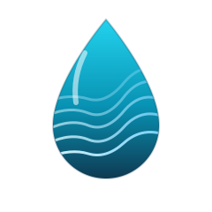

<div align="center">



# AquaScope

**Open-source Python toolkit for water data, hydrology, and agricultural water management — with an AI engine that recommends and auto-executes research methodologies.**

[](https://github.com/Rekin226/aquascope/actions/workflows/ci.yml)
[](https://pypi.org/project/aquascope/)
[](https://www.python.org/downloads/)
[](LICENSE)
[](https://github.com/astral-sh/ruff)
[](#)

[](https://github.com/Rekin226/aquascope/stargazers)
[](https://github.com/Rekin226/aquascope/network/members)

[**Install**](#-install) ·
[**Examples**](#-examples) ·
[**CLI**](#-cli) ·
[**Features**](docs/features.md) ·
[**Docs**](#-documentation) ·
[**Roadmap**](ROADMAP.md) ·
[**Discussions**](https://github.com/Rekin226/aquascope/discussions)

[](https://ko-fi.com/getaquascope) if AquaScope helps your research.

</div>

---

AquaScope unifies **19 global water-data sources** behind one Python schema, then layers a full scientific computing stack on top — from **Bulletin 17C flood frequency** to **FAO-56 crop water requirements** — wrapped in an AI engine that scores **26 research methodologies** against your dataset and auto-executes **7 analysis pipelines**. Validated against the CAMELS benchmark with 820+ tests.

---

## ✨ What you can do

- 🌊 **Pull water data** from USGS, FAO AQUASTAT, FAO WaPOR, GEMStat, EU WFD, Copernicus ERA5, Taiwan MOENV/WRA/Civil IoT/DataGov, Japan MLIT, Korea WAMIS, OpenMeteo, UN SDG 6, US Water Quality Portal — **one unified Python API**.
- 📈 **Run hydrological analyses** — Bulletin 17C flood frequency (GEV / LP3 / Gumbel / non-stationary GEV / EMA), baseflow separation, rating curves, 22 hydrological signatures.
- 🌾 **Plan agricultural water** — FAO-56 Penman-Monteith ET₀, crop water requirements for 20 crops, irrigation scheduling, soil water balance with auto-irrigation.
- 🤖 **Ask the AI engine** — describe your goal in plain English and get a recommended methodology, scored against your dataset profile and auto-executed. LLM enhancement via OpenAI, Groq (free), HuggingFace (free), or local Ollama.
- 📊 **Visualise + report** — 16 plot types, Q-Q / P-P diagnostics, Markdown / HTML reports with embedded figures, threshold alerts (WHO / EPA / EU WFD).
- 🗺️ **Spatial hydrology** — DEM processing, D8 flow direction, watershed delineation, Strahler ordering.

For the full capability list see [docs/features.md](docs/features.md).

## 📊 Why AquaScope

| | AquaScope | HEC-SSP | R `lmom` | Standalone collectors |
| :--- | :---: | :---: | :---: | :---: |
| Bulletin 17C FFA + EMA | ✅ | ✅ | partial | — |
| Non-stationary GEV | ✅ | — | partial | — |
| Baseflow separation (Lyne-Hollick, Eckhardt) | ✅ | — | — | — |
| FAO-56 Penman-Monteith ET₀ + crop water | ✅ | — | — | — |
| 15 unified data collectors | ✅ | — | — | per-source |
| AI methodology recommender (OpenAI / Groq / HF / Ollama) | ✅ | — | — | — |
| Interactive Streamlit dashboard | ✅ | — | — | — |
| Free, MIT, Python-native | ✅ | partial | ✅ | varies |

---

## ⚡ Install

```bash
pip install aquascope              # core — collectors + hydrology
pip install "aquascope[all]"       # everything — ML, viz, spatial, dashboard
```

Feature-group extras:

```bash
pip install "aquascope[ml]"           # sklearn, xgboost, statsmodels
pip install "aquascope[viz]"          # matplotlib, seaborn, folium
pip install "aquascope[scientific]"   # xarray, netcdf4, h5py
pip install "aquascope[interop]"      # xarray + geopandas (collect as_xarray / as_geodataframe)
pip install "aquascope[spatial]"      # rasterio, geopandas, shapely
pip install "aquascope[dashboard]"    # streamlit
pip install "aquascope[forecast]"     # prophet, torch (for LSTM)
```

For development:

```bash
git clone https://github.com/Rekin226/aquascope.git
cd aquascope
pip install -e ".[all,dev]"
```

---

## 🚀 Examples

### 1. Flood frequency analysis (Bulletin 17C)

```python
from aquascope.api import flood_analysis

result = flood_analysis(daily_discharge, method="gev", return_periods=[10, 50, 100])
print(result.return_levels)
#   return_period  return_level  lower_ci  upper_ci
# 0           10        1840.2     1690.4    2010.6
# 1           50        2530.7     2280.1    2820.9
# 2          100        2870.4     2540.6    3260.5
```

Switch `method` to `"lp3"`, `"gumbel"`, `"gpd"`, or `"ns_gev"` for non-stationary analysis. Pass `censored=True` for EMA on records with peak-over-threshold gaps.

### 2. Baseflow separation + hydrological signatures

```python
from aquascope.api import baseflow_analysis, compute_all_signatures

bf  = baseflow_analysis(daily_discharge, method="eckhardt")   # or "lyne_hollick"
sig = compute_all_signatures(daily_discharge)

print(bf.bfi)                  # baseflow index, e.g. 0.42
print(sig["Q5"], sig["Q95"])   # high-flow / low-flow exceedances
print(sig["flashiness"])       # Richards-Baker flashiness index
```

22 signatures across magnitude, variability, timing, recession, and flashiness — see [docs/features.md](docs/features.md#hydrological-analysis).

### 3. Collect data from any of the 19 sources

```python
from aquascope.collectors import USGSCollector, AquastatCollector, WaporCollector

usgs = USGSCollector()
flow = usgs.collect(station_id="01646500", parameter="00060", days=365)

aquastat = AquastatCollector()
egy_water = aquastat.collect(country="EGY", variables=[4263, 4253, 4312])

wapor = WaporCollector()
et = wapor.collect(
    bbox=(30.5, 29.8, 31.1, 30.2),
    variable="RET",
    start_date="2026-04-01",
    end_date="2026-07-31",
)
```

Every collector returns records in the **same Pydantic schema**, so downstream analyses don't care where the data came from. See [docs/data_sources.md](docs/data_sources.md) for the full list.

### 4. FAO-56 crop water requirements + soil water balance

```python
from datetime import date
from aquascope.agri import (
    penman_monteith_daily,
    crop_water_requirement,
    SoilWaterBalance,
)
from aquascope.agri.water_balance import SoilProperties

# Reference ET (FAO-56 Penman-Monteith) — Cairo, July
eto = penman_monteith_daily(
    t_min=18.0, t_max=32.0, rh_min=40, rh_max=80,
    u2=2.0, rs=22.0, latitude=30.0, elevation=70, doy=180,
)

# Crop water requirement for maize from planting through harvest
cwr = crop_water_requirement(eto_series, crop="maize", planting_date=date(2026, 4, 1))

# Soil water balance with auto-irrigation triggers — returns a daily DataFrame
soil    = SoilProperties(field_capacity=0.30, wilting_point=0.15, root_depth=1.0)
balance = SoilWaterBalance(soil).auto_irrigate(
    cwr["etc"], precip_series, efficiency=0.7,
)
print(balance["irrigation_mm"].sum())             # total irrigation applied (mm)
print(int(balance["irrigation_trigger"].sum()))   # number of deficit days
```

### 5. AI methodology recommender

```python
from aquascope.ai_engine import recommend

# Describe your dataset and goal — get ranked, scored methodologies
recs = recommend(
    parameters=["DO", "BOD5", "COD"],
    n_records=4_500,
    temporal=True,
    spatial=False,
    goal="detect long-term pollution trends with seasonality",
)

for r in recs[:3]:
    print(f"{r.score:.2f}  {r.method_id:<20}  {r.rationale}")
# 0.92  mann_kendall          Strong fit: temporal data, >30 records, trend goal
# 0.87  stl_decomposition     Seasonal patterns + multi-year data
# 0.81  prophet               Forecasting-capable, handles seasonality natively
```

Then auto-execute the top result with `run_pipeline(recs[0].method_id, df)`.

### 6. Change-point detection + copula dependence

```python
from aquascope.api import detect_changepoints, fit_copula

cps  = detect_changepoints(annual_runoff, method="pettitt")
cop  = fit_copula(rainfall, runoff, family="auto")    # AIC-selects Gaussian/Clayton/Gumbel/Frank
print(cps.change_year, cps.p_value)
print(cop.family, cop.theta, cop.aic)
```

### 7. Bayesian regression with uncertainty quantification

```python
from aquascope.api import bayesian_regression

# Annual rainfall → runoff with full posterior + convergence diagnostics
posterior = bayesian_regression(X=annual_precip, y=annual_runoff)

print(posterior.posterior_mean)
# {'beta_0': 12.4, 'beta_1': 0.82, 'sigma2': 41.6}

print(posterior.credible_intervals["beta_1"])
# (0.78, 0.86)        ← 95% credible interval on slope

print(posterior.r_hat)
# {'beta_0': 1.00, 'beta_1': 1.00, 'sigma2': 1.00}    ← Gelman–Rubin, converged

print(posterior.dic, posterior.effective_sample_size["beta_1"])
# 124.7  9842.0       ← model fit + effective sample size
```

Switch to MCMC with `degree>1` for polynomial models, or pass `prior_precision` for informative priors. Conjugate linear, polynomial, and Metropolis-Hastings backends are all available.

---

## 💻 CLI

AquaScope ships a 14-command CLI for the most common workflows:

```bash
# Collect data
aquascope collect --source usgs --station 01646500 --days 365
aquascope collect --source wapor --bbox 30.5,29.8,31.1,30.2 --variable RET --start-date 2026-04-01

# Hydrological analysis
aquascope hydro --method flood_frequency --file discharge.csv
aquascope hydro --method baseflow --file discharge.csv

# Agriculture planning
aquascope agri plan --crop maize --planting-date 2026-04-01 --lat 30.0 --lon 31.25

# AI recommendation + natural-language problem solving
aquascope recommend --parameters DO,BOD5,COD --goal "pollution trend detection"
aquascope solve --problem "Assess flood risk for a 100-year return period"

# Interactive Streamlit dashboard
aquascope dashboard
```

Run `aquascope --help` for the full command list.

---

## 🌍 Data sources at a glance

15 unified data sources spanning four regions:

- 🌎 **Americas** — USGS (streamflow + WQ), Water Quality Portal (400+ agencies)
- 🌍 **Europe** — EU Water Framework Directive, Copernicus ERA5
- 🌏 **Asia-Pacific** — Taiwan MOENV / WRA / Civil IoT / DataGov, Japan MLIT, Korea WAMIS
- 🌐 **Global** — GEMStat (170 countries), UN SDG 6, OpenMeteo, FAO AQUASTAT, FAO WaPOR

Full details, endpoints, and API-key requirements: [docs/data_sources.md](docs/data_sources.md). Want to add your country's water service? See [adding a data source](docs/guides/adding_data_source.md).

---

## 🧪 Scientifically validated

- **820+ tests** — covering every collector, hydrology method, and pipeline (spatial and ARIMA tests require the optional `[all]` / `[ml]` extras)
- **CAMELS benchmark** — a 10-catchment validation subset of the [CAMELS dataset](https://ral.ucar.edu/solutions/products/camels) ships with the repo at `data/camels_benchmark/` and runs as part of CI
- **Every method cited** — equations, decision trees, and DOI references for all 26 methodologies live in the [theory guide](docs/theory.md)
- **JOSS paper in submission** — see [`paper.md`](paper.md) and [`paper.bib`](paper.bib)

---

## 📚 Documentation

| Resource | What it covers |
| :--- | :--- |
| [Features](docs/features.md) | Full capability list — hydrology, agriculture, ML, spatial, I/O |
| [Data sources](docs/data_sources.md) | All 19 sources, endpoints, API-key requirements |
| [Theory guide](docs/theory.md) | Equations, DOI citations, decision trees for every method |
| [Methodology matrix](docs/methodology_matrix.md) | When to use which method |
| [Architecture](docs/guides/architecture.md) | How AquaScope is structured internally |
| [FAQ](docs/faq.md) · [Troubleshooting](docs/troubleshooting.md) | Common questions and fixes |
| [Use cases](docs/use_cases.md) | Real-world applications and case studies |
| [Integration guides](docs/integration_guides/) | xarray, QGIS, R interoperability |
| [Contributing](CONTRIBUTING.md) | How to add a data source, methodology, or test |

---

## 🤝 Contributing

We welcome contributions from the global water and agriculture research community. Highest-impact contributions right now:

- **New data source collectors** — your country / region
- **New research methodologies** — expand the AI recommender
- **New crop coefficients** — extend the FAO Kc table
- **Jupyter tutorials** and validation studies — compare against HEC-SSP, R packages, etc.

### 📌 Where to start

📍 **[Data sources wanted — help us map every country's water data 🌍](https://github.com/Rekin226/aquascope/issues/11)** — our pinned meta-issue. Want your country in AquaScope? Start here.

New contributor? These [`good first issue`](https://github.com/Rekin226/aquascope/labels/good%20first%20issue)s are scoped with clear acceptance criteria — just comment to claim one:

| Area | Open issues |
| :--- | :--- |
| 🌍 **New data collectors** | [India](https://github.com/Rekin226/aquascope/issues/16) · [Brazil](https://github.com/Rekin226/aquascope/issues/17) · [Canada](https://github.com/Rekin226/aquascope/issues/18) · [UK](https://github.com/Rekin226/aquascope/issues/19) · [South Africa](https://github.com/Rekin226/aquascope/issues/20) · [Australia](https://github.com/Rekin226/aquascope/issues/4) |
| 🌾 **Agriculture** | [Kc for millet/cassava/chickpea](https://github.com/Rekin226/aquascope/issues/21) · [dual crop coefficient](https://github.com/Rekin226/aquascope/issues/22) · [Kc for sorghum/groundnut/sugar beet](https://github.com/Rekin226/aquascope/issues/5) |
| 📈 **Methodologies** | [SPEI drought index](https://github.com/Rekin226/aquascope/issues/23) · [Budyko framework](https://github.com/Rekin226/aquascope/issues/24) |
| 📊 **Visualization** | [interactive Plotly hydrograph](https://github.com/Rekin226/aquascope/issues/25) · [double-mass curve](https://github.com/Rekin226/aquascope/issues/26) |
| 💻 **CLI** | [`--output` to JSON/CSV](https://github.com/Rekin226/aquascope/issues/27) · [shell completion](https://github.com/Rekin226/aquascope/issues/28) · [geojson format](https://github.com/Rekin226/aquascope/issues/7) |
| 📚 **Docs & tutorials** | [Colab/Binder badges](https://github.com/Rekin226/aquascope/issues/29) · [groundwater notebook](https://github.com/Rekin226/aquascope/issues/30) · [agri irrigation notebook](https://github.com/Rekin226/aquascope/issues/6) · [translate the docs (zh/fr/ja)](https://github.com/Rekin226/aquascope/issues/31) |
| 🧪 **Code quality & tests** | [type annotations](https://github.com/Rekin226/aquascope/issues/32) · [SoilWaterBalance edge-case tests](https://github.com/Rekin226/aquascope/issues/33) |
| 🚀 **Infra** | [hosted Streamlit demo](https://github.com/Rekin226/aquascope/issues/34) |

Browse the [full issue list](https://github.com/Rekin226/aquascope/issues) or vote on what to build next in [Discussions → Ideas](https://github.com/Rekin226/aquascope/discussions/categories/ideas).

See [CONTRIBUTING.md](CONTRIBUTING.md), the [adding a data source](docs/guides/adding_data_source.md) guide, and the [adding a methodology](docs/guides/adding_methodology.md) guide.

### 🪜 The contributor ladder

We want contributors to grow, not vanish after one PR. There's a clear path: start with a [`good first issue`](https://github.com/Rekin226/aquascope/labels/good%20first%20issue), then graduate to a [`good second issue`](https://github.com/Rekin226/aquascope/labels/good%20second%20issue) (a bigger self-contained piece that builds on what you learned), and after a few PRs in one area we'll invite you to help triage and review. See [CONTRIBUTORS.md](CONTRIBUTORS.md) for details.

## 🙌 Contributors

Thanks to these wonderful people who make AquaScope possible ([emoji key](CONTRIBUTORS.md#contribution-key)):

<!-- ALL-CONTRIBUTORS-LIST:START - Do not remove or modify this section -->
<table>
  <tbody>
    <tr>
      <td align="center" valign="top" width="20%"><a href="https://github.com/Rekin226"><br /><sub><b>Abdoul Rachid Ouedraogo</b></sub></a><br />💻 📖 🚧</td>
      <td align="center" valign="top" width="20%"><a href="https://github.com/vaishnavidesai09"><br /><sub><b>Vaishnavi Desai</b></sub></a><br />🔌</td>
      <td align="center" valign="top" width="20%"><a href="https://github.com/Karthick03219"><br /><sub><b>Karthick</b></sub></a><br />💻</td>
      <td align="center" valign="top" width="20%"><a href="https://github.com/sagiB74"><br /><sub><b>sagiB74</b></sub></a><br />⚠️</td>
      <td align="center" valign="top" width="20%"><a href="https://github.com/laishettikarthik-tech"><br /><sub><b>Karthik Laishetti</b></sub></a><br />💻 🐛</td>
    </tr>
  </tbody>
</table>
<!-- ALL-CONTRIBUTORS-LIST:END -->

Your first merged PR puts you on this board, every kind of contribution counts. See [CONTRIBUTORS.md](CONTRIBUTORS.md).

## 📜 Citation

If you use AquaScope in your research, please cite:

```bibtex
@software{aquascope2026,
  title   = {AquaScope: Open-Source Water Data Aggregation, Hydrological Analysis, and Agricultural Water Management Toolkit},
  author  = {AquaScope Contributors},
  year    = {2026},
  url     = {https://github.com/Rekin226/aquascope},
  version = {0.6.0},
  license = {MIT}
}
```

## 📄 License

MIT — see [LICENSE](LICENSE).
