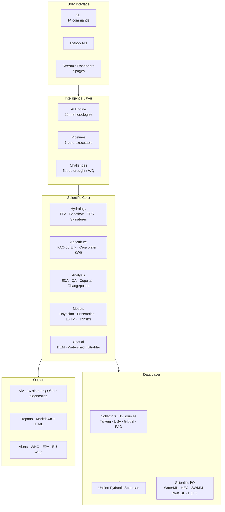

<div align="center">


# AquaScope

**Open-source water data aggregation, hydrological analysis, and agricultural water management toolkit — with an AI engine that recommends and executes research methodologies.**

[](https://github.com/Rekin226/aquascope/actions/workflows/ci.yml)
[](https://pypi.org/project/aquascope/)
[](https://pypi.org/project/aquascope/)
[](https://www.python.org/downloads/)
[](LICENSE)
[](https://github.com/astral-sh/ruff)
[](#)

[](https://github.com/Rekin226/aquascope/stargazers)
[](https://github.com/Rekin226/aquascope/network/members)
[](https://github.com/Rekin226/aquascope/issues)

[**Documentation**](docs/theory.md) ·
[**Quick Start**](#quick-start) ·
[**Data Sources**](#data-sources) ·
[**Roadmap**](#roadmap) ·
[**Citation**](#citation)

</div>

---

> AquaScope collects water-quality, hydrology, and agricultural data from **12 global sources**, normalises it into unified schemas, and provides a complete scientific computing stack — from **Bulletin 17C flood frequency** to **FAO-56 crop water requirements** — wrapped in an AI engine that scores **26 research methodologies** against your dataset and auto-executes **7 analysis pipelines**.

---

## Features

### Data Collection (12 sources)
- **Taiwan** — MOENV water quality, WRA levels/reservoirs, Civil IoT sensors
- **USA** — USGS streamflow, Water Quality Portal (400+ agencies)
- **Global** — GEMStat (170 countries), UN SDG 6, OpenMeteo weather, Copernicus climate
- **FAO** — AQUASTAT country-level water use, WaPOR satellite evapotranspiration

### Hydrological Analysis
- **Flood frequency** — GEV, LP3 (Bulletin 17C compliant), Gumbel, GPD/POT, L-moments, non-stationary GEV, regional frequency analysis, EMA for censored data
- **Baseflow separation** — Lyne-Hollick & Eckhardt digital filters
- **Flow duration curves** — Weibull plotting, FDC slope
- **22 hydrological signatures** — magnitude, variability, timing, recession, flashiness
- **Rating curves** — power-law fitting, segmented curves, shift detection, HEC-RAS export
- **Q-Q/P-P diagnostics** — distribution fit validation with 4-panel diagnostic plots
- **Cross-validation** — leave-one-out CV and coverage probability for flood frequency

### Agricultural Water Management (NEW)
- **FAO-56 Penman-Monteith ET₀** — reference evapotranspiration with all intermediate steps
- **Hargreaves ET₀** — temperature-only alternative
- **Crop water requirements** — 20 crops with FAO-56 Kc coefficients and growth stages
- **Irrigation scheduling** — effective rainfall, net/gross demand, efficiency
- **Soil water balance** — daily tracking, depletion, auto-irrigation triggers
- **WaPOR productivity workflows** — biomass water productivity and AETI-to-RET performance metrics

### Statistical & ML Methods
- **Copula analysis** — Gaussian, Clayton, Gumbel, Frank with AIC selection
- **Change-point detection** — PELT, CUSUM, Pettitt test, binary segmentation
- **Bayesian UQ** — conjugate linear regression, Metropolis-Hastings MCMC, Gelman-Rubin R̂
- **Model ensembles** — weighted, stacking, adaptive strategies
- **Transfer learning** — donor selection via signature similarity for ungauged basins
- **Predictive models** — Prophet, ARIMA, SPI, Random Forest, XGBoost, Isolation Forest, LSTM

### Spatial & I/O
- **Spatial hydrology** — DEM processing, D8 flow direction, watershed delineation, Strahler ordering
- **Scientific I/O** — WaterML 2.0, HEC-DSS/RAS, EPA SWMM, NetCDF, HDF5, GeoJSON

### AI Engine & Workflows
- **26 research methodologies** — scored and ranked against dataset profiles
- **7 auto-executable pipelines** — trend analysis, WQI, PCA, RF, XGBoost, ARIMA, correlation
- **Challenge workflows** — flood risk (GEV), drought severity (SPI), water quality (WHO)
- **Natural-language agent** — describe your goal, get recommendations + execution

### Visualization & Reporting
- **16 plot functions** — time-series, box plots, heatmaps, spatial maps (Folium), FDC, hydrographs
- **Diagnostic plots** — Q-Q, P-P, return level, 4-panel diagnostic panel
- **Automated reports** — Markdown & HTML with embedded plots, metrics, TOC
- **Alerts** — WHO, US EPA, EU WFD threshold checking

### Infrastructure
- **534 tests** with CAMELS benchmark validation
- **Interactive dashboard** — 7-page Streamlit app
- **14 CLI commands** — collect, recommend, eda, quality, run, solve, forecast, plot, hydro, alerts, dashboard, agri, list-methods, list-sources
- **[Theory guide](docs/theory.md)** — mathematical equations, DOI citations, decision trees

---

## Architecture



---

## Screenshots

> Placeholders — drop PNG/GIFs into `docs/assets/` and replace these references.

<div align="center">

| Streamlit dashboard | Flood frequency (GEV) | Watershed delineation |
| :---: | :---: | :---: |
|  |  |  |
| 7-page interactive app | Bulletin 17C-compliant FFA with return-level CIs | D8 flow direction + Strahler ordering |

</div>

> **Quick demo (Colab):** _coming soon — add a notebook badge here once published._

---

## Data Sources

| Source | Region | Data Types | API | Status |
|--------|--------|------------|-----|--------|
| [Taiwan MOENV](https://data.moenv.gov.tw) | Taiwan | River/tap water quality, RPI | REST | ✅ |
| [Taiwan WRA](https://opendata.wra.gov.tw) | Taiwan | Water levels, reservoir status | REST | ✅ |
| [Taiwan Civil IoT](https://sta.ci.taiwan.gov.tw) | Taiwan | Real-time sensors (level, flow, rain) | SensorThings | ✅ |
| [USGS](https://api.waterdata.usgs.gov) | USA | Streamflow, water quality, gage height | OGC | ✅ |
| [Water Quality Portal](https://waterqualitydata.us) | USA | Integrated WQ from 400+ agencies | REST/CSV | ✅ |
| [GEMStat](https://gemstat.org) | Global | Freshwater quality (170+ countries) | Zenodo | ✅ |
| [UN SDG 6](https://sdg6data.org) | Global | SDG 6 indicators (6.1.1 – 6.6.1) | REST | ✅ |
| [OpenMeteo](https://open-meteo.com) | Global | Weather data (temp, precip, wind, solar) | REST | ✅ |
| [Copernicus](https://cds.climate.copernicus.eu) | Global | ERA5 reanalysis, climate projections | CDS API | ✅ |
| [FAO AQUASTAT](https://www.fao.org/aquastat) | Global | Country-level water withdrawal, irrigation | FAOSTAT API | ✅ |
| [FAO WaPOR](https://www.fao.org/in-action/remote-sensing-for-water-productivity) | Global | Satellite ET, biomass, water productivity | REST | ✅ |

**Want to add your country's water data?** See our [guide to adding data sources](docs/guides/adding_data_source.md).

---

## Why AquaScope

| | AquaScope | HEC-SSP | R `lmom` / `lmomRFA` | Standalone collectors |
| :--- | :---: | :---: | :---: | :---: |
| Bulletin 17C FFA + EMA | ✅ | ✅ | partial | — |
| Non-stationary GEV | ✅ | — | partial | — |
| Baseflow separation (Lyne-Hollick, Eckhardt) | ✅ | — | — | — |
| FAO-56 Penman-Monteith ET₀ + crop water | ✅ | — | — | — |
| 12 unified data-source collectors | ✅ | — | — | per-source |
| AI methodology recommender | ✅ | — | — | — |
| Streamlit dashboard | ✅ | — | — | — |
| Free & open source (MIT) | ✅ | ✅ | ✅ | varies |
| Python-native | ✅ | — | — | varies |

---

## Quick Start

### Installation

```bash
# Full install (all features)
git clone https://github.com/Rekin226/aquascope.git
cd aquascope
pip install -e ".[all]"

# Minimal install (collectors + core hydrology)
pip install -e .

# Specific feature groups
pip install -e ".[ml]"          # ML models (sklearn, xgboost)
pip install -e ".[viz]"         # Plotting (matplotlib, folium)
pip install -e ".[scientific]"  # NetCDF, HDF5 export
pip install -e ".[spatial]"     # DEM/watershed (rasterio, geopandas)
pip install -e ".[dashboard]"   # Streamlit app
```

### High-Level API (Recommended)

```python
from aquascope.api import (
    flood_analysis,
    baseflow_analysis,
    flow_duration,
    compute_all_signatures,
    detect_changepoints,
    fit_copula,
    bayesian_regression,
    generate_report,
)

# One-liner flood frequency analysis
result = flood_analysis(daily_discharge, method="gev", return_periods=[10, 50, 100])

# Baseflow separation
bf = baseflow_analysis(daily_discharge, method="eckhardt")

# All 22 hydrological signatures
sigs = compute_all_signatures(daily_discharge)

# Change-point detection
cps = detect_changepoints(annual_series, method="pettitt")

# Copula fitting (auto-selects best family by AIC)
cop = fit_copula(flow_x, flow_y, family="auto")
```

### FAO-56 Crop Water Requirements

```python
from aquascope.agri import (
  benchmark_aquastat,
  crop_water_requirement,
  estimate_wapor_productivity,
  penman_monteith_daily,
  SoilWaterBalance,
)
from aquascope.agri.water_balance import SoilProperties

# Reference ET (FAO-56 Penman-Monteith)
eto = penman_monteith_daily(
    t_min=18.0, t_max=32.0, rh_min=40, rh_max=80,
    u2=2.0, rs=22.0, latitude=25.0, elevation=100, doy=180,
)

# Crop water requirement for maize
cwr = crop_water_requirement(eto_series, crop="maize", planting_date=date(2026, 4, 1))

# Soil water balance with auto-irrigation
soil = SoilProperties(field_capacity=0.30, wilting_point=0.15, root_depth=1.0)
swb = SoilWaterBalance(soil)
balance = swb.auto_irrigate(etc_series, precip_series, efficiency=0.7)

# AQUASTAT country benchmarking
benchmark = benchmark_aquastat(aquastat_df, "agricultural_withdrawal_share_pct")
print(benchmark.table.head())

# WaPOR productivity workflow
productivity = estimate_wapor_productivity(
  metric_id="biomass_water_productivity",
  aeti_df=aeti_df,
  npp_df=npp_df,
  ret_df=ret_df,
  aquastat_df=aquastat_df,
  aquastat_countries=["EGY", "MAR"],
)
print(productivity.aggregate_value)
print(productivity.aquastat_context[0].table.head())
```

### CLI Usage

```bash
# Collect data
aquascope collect --source usgs --days 7
aquascope collect --source taiwan_moenv --api-key YOUR_KEY
aquascope collect --source aquastat --country EGY --variables 4263,4253,4312
aquascope collect --source wapor --bbox 30.5,29.8,31.1,30.2 --variable RET --start-date 2026-04-01 --end-date 2026-07-31

# Hydrological analysis
aquascope hydro --method flood_frequency --file discharge.csv
aquascope hydro --method baseflow --file discharge.csv

# Agriculture planning
aquascope agri plan --crop maize --planting-date 2026-04-01 --lat 29.95 --lon 31.25
aquascope agri benchmark --aquastat-file data/raw/aquastat_latest.json --metric agricultural_withdrawal_share_pct
aquascope agri productivity --metric biomass_water_productivity --aeti-file data/raw/wapor_aeti.json --npp-file data/raw/wapor_npp.json --ret-file data/raw/wapor_ret.json
aquascope agri productivity --metric biomass_water_productivity --aeti-file data/raw/wapor_aeti.json --npp-file data/raw/wapor_npp.json --aquastat-file data/raw/aquastat_latest.json --aquastat-countries EGY,MAR

# AI-powered recommendations
aquascope recommend --parameters DO,BOD5,COD --goal "pollution trend detection"

# Natural-language problem solving
aquascope solve --problem "Assess flood risk for a 100-year return period"

# Visualisation
aquascope plot --type timeseries --file data.csv --parameter discharge

# Alert checking
aquascope alerts --file water_quality.csv --standard who

# Interactive dashboard
aquascope dashboard
```

---

## Documentation

| Resource | Description |
|----------|-------------|
| [Theory Guide](docs/theory.md) | Mathematical equations, DOI references, and decision trees for every method |
| [FAQ](docs/faq.md) | Frequently asked questions |
| [Troubleshooting](docs/troubleshooting.md) | Common issues and solutions |
| [Methodology Matrix](docs/methodology_matrix.md) | When to use which method |
| [Integration Guides](docs/integration_guides/) | xarray, QGIS, R interoperability |
| [Use Cases](docs/use_cases.md) | Real-world application examples |
| [Adding a Data Source](docs/guides/adding_data_source.md) | Contributor guide |
| [Adding a Methodology](docs/guides/adding_methodology.md) | Contributor guide |
| [FAO Agriculture Plan](docs/guides/fao_agriculture_plan.md) | FAO endpoints, integration priorities, schemas, commands, and workflows |

---

## Project Structure

```
aquascope/
├── aquascope/
│   ├── agri/               # FAO-56 ET₀, crop water, soil water balance
│   ├── ai_engine/          # AI recommender, NL agent, planner
│   ├── alerts/             # WHO/EPA/EU WFD threshold checking
│   ├── analysis/           # EDA, quality, changepoint, copulas
│   ├── challenges/         # Flood, drought, water quality workflows
│   ├── collectors/         # 12 data source modules (11 + base)
│   ├── dashboard/          # 7-page Streamlit interactive app
│   ├── hydrology/          # FFA, baseflow, FDC, signatures, rating curves
│   ├── io/                 # WaterML 2.0, HEC-DSS/RAS, EPA SWMM
│   ├── models/             # Statistical, ML, LSTM, Bayesian, ensemble, transfer
│   ├── pipelines/          # 7 auto-executable analysis pipelines
│   ├── reporting/          # Markdown & HTML report generation
│   ├── schemas/            # Pydantic data models (water + agriculture)
│   ├── spatial/            # DEM, flow direction, watershed delineation
│   ├── utils/              # HTTP client, storage, import helpers
│   ├── viz/                # 16 plots + Q-Q/P-P diagnostics
│   ├── api.py              # High-level convenience API
│   └── cli.py              # 13-command CLI
├── tests/                  # 534 tests (incl. CAMELS benchmarks)
├── data/camels_benchmark/  # 10 catchment validation dataset
├── examples/               # Scripts and validation suite
├── notebooks/              # Jupyter tutorials
├── docs/                   # Theory guide, FAQ, guides
└── pyproject.toml          # v0.3.0
```

---

## Built-in Research Methodologies (26)

| Category | Methodologies | Pipelines |
|----------|--------------|-----------|
| Statistical | Mann-Kendall Trend, WQI/RPI, PCA + Clustering, Correlation, Bayesian Inference, Copula Dependence | ✅ 4 |
| Machine Learning | LSTM, Random Forest, XGBoost, Transformer, Autoencoder Anomaly Detection | ✅ 2 |
| Time-Series | ARIMA/SARIMA Forecasting | ✅ 1 |
| Process Engineering | MBBR Pilot, MBR Fouling, A2O Nutrient Removal, SWMM, QUAL2K | — |
| Spatial Analysis | Satellite Eutrophication, GIS Watershed, Kriging Interpolation | — |
| Hydrological | SWAT Modelling, Isotope Hydrology, Paired Watershed Design | — |
| Policy | SDG 6 Benchmarking, IWRM Assessment | — |

---

## Getting API Keys

| Source | Key Required? | How to Get |
|--------|:---:|------------|
| Taiwan MOENV | Recommended | [Register here](https://data.moenv.gov.tw/en/apikey) (free) |
| Taiwan WRA / Civil IoT | No | Open access |
| USGS | Optional | [Request here](https://api.waterdata.usgs.gov/docs/ogcapi/#api-keys) (free) |
| Water Quality Portal | No | Open access |
| GEMStat | No | Open access via Zenodo |
| UN SDG 6 | No | Open access |
| OpenMeteo | No | Open access |
| Copernicus CDS | Yes | [Register here](https://cds.climate.copernicus.eu/user/register) (free) |
| FAO AQUASTAT / WaPOR | No | Open access |

---

## Roadmap

- [x] 12 data source collectors (Taiwan, USA, Global, FAO)
- [x] Rule-based + LLM methodology recommender (26 methods)
- [x] 7 auto-executable analysis pipelines
- [x] Bulletin 17C flood frequency with EMA
- [x] FAO-56 Penman-Monteith + crop water requirements
- [x] Bayesian UQ, copulas, ensembles, transfer learning
- [x] Spatial hydrology (DEM, watershed, Strahler)
- [x] Scientific I/O (WaterML, HEC, SWMM, NetCDF, HDF5)
- [x] Interactive Streamlit dashboard
- [x] 776+ tests with CAMELS benchmark validation
- [x] Theory guide with equations and DOI citations
- [x] EU Water Framework Directive collector
- [x] Japan MLIT / Korea WAMIS collectors
- [x] Groundwater module (GRACE, well databases, recharge, aquifer hydraulics)
- [x] Climate projection workflows (CMIP6, downscaling, PDSI, scenario analysis)
- [x] JOSS paper submission (paper.md + paper.bib)
- [x] PyPI release (sdist + wheel + GitHub Actions publish workflow)
- [ ] Multi-language documentation (中文, Français, 日本語)

---

## Contributing

We welcome contributions from the global water and agriculture research community! See [CONTRIBUTING.md](CONTRIBUTING.md).

**High-impact contributions:**

- **New data source collectors** — Add APIs from your country
- **New research methodologies** — Expand the AI recommender
- **New crop coefficients** — Extend the FAO Kc table
- **Jupyter notebooks** — Tutorials and case studies
- **Validation studies** — Compare against established tools (HEC-SSP, R packages)

---

## Citation

If you use AquaScope in your research, please cite:

```bibtex
@software{aquascope2026,
  title     = {AquaScope: Open-Source Water Data Aggregation, Hydrological Analysis, and Agricultural Water Management Toolkit},
  author    = {AquaScope Contributors},
  year      = {2026},
  url       = {https://github.com/Rekin226/aquascope},
  version   = {0.4.0},
  license   = {MIT}
}
```

## License

MIT License — see [LICENSE](LICENSE).
