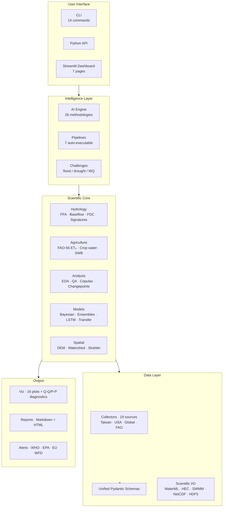

# AquaScope Architecture

## Overview

AquaScope follows a modular, layered architecture designed for extensibility and researcher-friendly workflows.



## Layer Descriptions

### 1. Collectors (`aquascope/collectors/`)

Each collector inherits from `BaseCollector` and implements two methods:
- `fetch_raw(**kwargs) -> list[dict]` — Fetch raw data from the API
- `normalise(raw) -> Sequence[WaterQualitySample | ...]` — Transform into unified schema

The `collect()` method (from BaseCollector) chains these together: fetch → normalise.

**Key design principle:** Collectors are stateless. They receive configuration via constructor arguments (API keys, rate limits) and return pure data. The `CachedHTTPClient` handles caching and rate limiting transparently.

### 2. Unified Schemas (`aquascope/schemas/`)

All data from every source is normalised into one of:
- `WaterQualitySample` — Point measurements (DO, pH, BOD5, etc.)
- `WaterLevelReading` — River/reservoir water levels
- `ReservoirStatus` — Daily reservoir operational data
- `SDG6Indicator` — UN SDG 6 country-level metrics

Every record carries a `DataSource` enum identifying its origin. This means downstream code never needs to know which API the data came from.

### 3. Analysis (`aquascope/analysis/`)

- **EDA module** — Auto-profiles any water dataset: statistics, distributions, outliers, correlations, completeness. Outputs an `EDAReport` that can be pretty-printed or fed to the recommender.
- **Quality module** — Assesses data quality (duplicates, missing values, temporal gaps, unit inconsistencies) and provides automated preprocessing (imputation, outlier removal, resampling).

### 4. Pipelines (`aquascope/pipelines/`)

Auto-build and run approved methodologies. The pipeline registry maps method IDs to implementations:

```python
from aquascope.pipelines.model_builder import run_pipeline

result = run_pipeline("correlation_analysis", df)
print(result.summary)
print(result.metrics)
```

Each pipeline returns a `PipelineResult` with summary text, structured metrics, and optional figure paths.

### 5. AI Engine (`aquascope/ai_engine/`)

- **Knowledge Base** — 26 research methodologies with metadata: applicable parameters, data requirements, complexity, references, tags.
- **Recommender** — Scores each methodology against a `DatasetProfile` using a multi-criteria rule engine. Optional LLM mode for deeper reasoning via OpenAI-compatible APIs (including local Ollama).

### 6. CLI (`aquascope/cli.py`)

Seven commands: `collect`, `recommend`, `eda`, `quality`, `run`, `list-methods`, `list-sources`. Each wraps the Python API with argument parsing.

## Data Flow

```
1. Collect:   API → Collector.fetch_raw() → Collector.normalise() → Unified records
2. Store:     Records → JSON/CSV file (data/raw/)
3. Analyse:   DataFrame → EDA report + Quality assessment
4. Recommend: DatasetProfile → AI recommender → Ranked methodologies
5. Execute:   DataFrame + method_id → Pipeline → PipelineResult (metrics + figures)
```

## Extending AquaScope

- **Add a data source** → See [Adding a Data Source](adding_data_source.md)
- **Add a methodology** → See [Adding a Methodology](adding_methodology.md)
- **Add a pipeline** → See [Running Pipelines](running_pipelines.md)
